# 数据中的结构和联合

## 结构基础知识

### 聚合数据类型(aggregate data type)

聚合数据类型能够同时存储超过一个的单独数据。<span style="color: green">c提供了两种类型的聚合数据类型，<span style="background-color: greenyellow">数组和结构</span></span>

<span style="color: green">结构也是一些值的集合，这些值称为它的成员（member），<span style="background-color: greenyellow">但一个结构的各个成员可能具有不同的类型。</span></span>

数组元素的可以通过下标访问，这只是因为数组的元素长度相同。<span style="color:red">但是，在结构中情况并非如此。由于一个结构的成员可能长度不同，所以不能使用下标来访问它们。</span>

每个结构的成员都有自己的名字，它们是通过名字访问的。

结构变量属于标量类型。

#### 结构的声明

```c
#include <stdio.h>

int main(int argc, char *argv[]) {
    struct {
        int a;
        int c;
    } demo;
    demo.c = 100;
    demo.a = 110;
    printf("%d", demo.a);
    return 0;
}
```

```c
#include <stdio.h>

int main(int argc, char *argv[]) {
    struct {
        int a;
        char b;
        float c;
    } y[20], *z;// 声明一个结构数组，和一个该结构同类型的指针
    return 0;
}
```

```c
#include <stdio.h>

int main(int argc, char *argv[]) {
    // 给结构打个标签叫Demo
    struct Demo {
        int a;
        char b;
        float c;
    } demo01;
    struct Demo demo02;// 通过已经定义的结构标签，来定义一个结构
    demo01.a = 101;
    demo02.a = 102;
    printf("%d", demo01.a);
    printf("%d", demo02.a);
    return 0;
}
```

```c
#include <stdio.h>

int main(int argc, char *argv[]) {

    typedef struct {
        int a;
        float b;
        char c;
    } Demo;

    Demo demo;
    demo.a = 101;
    demo.b = 110;

    printf("a: %d\n", demo.a);
    printf("b: %f\n", demo.b);

    return 0;
}
```

**通过指针访问结构**

```c
#include <stdio.h>

int main(int argc, char *argv[]) {

    typedef struct {
        int a;
        float b;
        char c;
    } Demo;

    Demo demo, *p;
    p = &demo;
    p->a = 101;
    printf("a: %d\n", demo.a);
    (*p).b = 110;// 由于“.”的优先级高于“*”，需要“()”提升优先级
    printf("b: %f\n", demo.b);

    return 0;
}
```

**结构的不完整声明**

```c
#include <stdio.h>

int main(int argc, char *argv[]) {

    struct B;

    struct A {
        struct B *partner;
    };

    struct B {
        struct A *partner;
    };

    return 0;
}
```

在A的成员列表中需要标签B的不完整声明。一旦A被声明之后，B的成员列表也可以被声明。

#### 注意事项

<span style="color: red">声明一个结构A，A有一个成员p，p的类型就是结构A，那么P需要声明为指针，否则就会出现递归的结构声明。</span>如下所示

```c
#include <stdio.h>

int main(int argc, char *argv[]) {

    struct A {
        int a;
        struct A *p;
    };

    struct A demo;
    demo.a = 100;
    struct A demo01;
    demo.p = &demo01;
    (*demo.p).a = 110;

    printf("demo a: %d\n", demo.a);
    printf("demo01 a: %d\n", demo.p->a);

    return 0;
}
```

# 结构成员的内存对齐

例一：

```c
#include <stdio.h>

int main() {

    struct Demo {
        char a;
        int b;
        char c;
    };

    printf("size: %lu", sizeof(struct Demo));// 输出内存大小

    return 0;
}
```

```bash
/home/aszswaz/project/CLionProjects/demo/cmake-build-debug/demo
size: 12
Process finished with exit code 0
```

例一的结构内存，如图所示：



<span style="color: red">系统禁止编译器在一个结构的起始位置，跳过几个字节来满足边界对齐要求，因此所有结构的起始位置必须是结构中边界要求最严格的数据类型所要求的位置。</span>因此成员a必须存储于一个能够被4整除的地址，结构的下一个成员变量是一个整型值，所以它必须跳过三个字节到达合适的边界才能存储。

例二：

```c
#include <stdio.h>

int main() {

    struct Demo {
        int b;
        char a;
        char c;
    };

    printf("size: %lu", sizeof(struct Demo));// 输出内存大小

    return 0;
}
```

```bash
/home/aszswaz/project/CLionProjects/demo/cmake-build-debug/demo
size: 8
Process finished with exit code 0
```

例二的结构内存，如图：



所包含的成员和前面那个结构一样，但它只占用8个字节的空间，节省了33%。两个字符可以紧挨着存储，所以只有结构最后面需要跳过的两个字节才被浪费。

### sizeof

```c
#include <stdio.h>

int main() {

    struct Demo {
        char a;
        char b;
        char c;
    };

    // sizeof输出结构的长度，包括因边界对齐而跳过的那些字节
    printf("size: %lu", sizeof(struct Demo));

    return 0;
}
```

### offsetof

```c
#include <stdio.h>
#include <stddef.h>

int main() {

    struct Demo {
        int a;
        char b;
        char c;
    };

    /*
     * offsetof(定义于stddef.h)可以确定某个成员相对于结构位置的实际位置
     * offsetof( type, member ) "type"就是结构的类型，member就是成员,表达式的结果是一个size_t的值，表示这个成员开始存储的位置，距离结构开始存储的位置，偏移几个字节。
     */
    printf("address: %lu", offsetof(struct Demo, b));

    return 0;
}
```

```bash
/home/aszswaz/project/CLionProjects/demo/cmake-build-debug/demo
address: 4
Process finished with exit code 0
```

# 作为函数参数的结构

结构是一个`标量`，因此结构可以作为参数传递给一个函数。<span style="color: red">但它的效率很低，因为C语言的参传值调用方式要求把参数的一份拷贝传递给参数。</span>

```c
#include <stdio.h>

typedef struct {
    int a;
    char b;
    char c;
} Demo;

void demoMethod(Demo demo);

int main() {

    Demo demo;
    demo.a = 110;
    demoMethod(demo);
    printf("main value: %d\n", demo.a);

    return 0;
}

void demoMethod(Demo demo) {
    demo.a = 100;
    printf("demo value: %d\n", demo.a);
}
```

如上所示 demoMethod 方法中的赋值操作，并没有影响main函数中的结构。

```bash
/home/aszswaz/project/CLionProjects/demo/cmake-build-debug/demo
demo value: 100
main value: 110

Process finished with exit code 0
```

<span style="color: green">建议通过指针进行传参，操作如下</span>

```c
#include <stdio.h>

typedef struct {
    int a;
    char b;
    char c;
} Demo;

void demoMethod(Demo *demo);

int main() {

    Demo demo;
    demo.a = 110;
    demoMethod(&demo);
    printf("main value: %d\n", demo.a);

    return 0;
}

void demoMethod(Demo *demo) {
    demo->a = 100;
    printf("demo value: %d\n", demo->a);
}
```

```bash
/home/aszswaz/project/CLionProjects/demo/cmake-build-debug/demo
demo value: 100
main value: 100

Process finished with exit code 0
```

# 位段（位域）

有些数据在存储时并不需要占用一个完整的字节，只需要占用一个或几个二进制位即可。例如开关只有通电和断电两种状态，用 0 和 1 表示足以，也就是用一个二进位。正是基于这种考虑，C语言又提供了一种叫做`位域`的数据结构。

```c
#include <stdio.h>

int main() {
    struct bs {
        unsigned m;
        unsigned n: 4;
        unsigned char ch: 6;
    } a = {0xad, 0xE, '$'};
    //第一次输出
    printf("%#x, %#x, %c\n", a.m, a.n, a.ch);
    //更改值后再次输出
    a.m = 0xb8901c;
    a.n = 0x2d;
    a.ch = 'z';
    printf("%#x, %#x, %c\n", a.m, a.n, a.ch);
    return 0;
}
```

```bash
/home/aszswaz/project/CLionProjects/demo/cmake-build-debug/demo
0xad, 0xe, $
0xb8901c, 0xd, :

Process finished with exit code 0
```

# 联合

<span style="color: green">联合的所有成员引用的是内存中的相同的位置。</span>当你向在不同的时刻把不同的东西存储于同一位置时，就可以使用联合.

```c
#include "stdio.h"

// 声明一个“联合”
typedef union {
    float f;
    int a;
} Demo;

int main() {
    Demo test;

    // 对成员f进行赋值，观察成员a的变化
    test.f = 1.000f;
    printf("f: %f; a: %d\n", test.f, test.a);

    // 保留当前成员a的值
    const int copy = test.a;

    // 对成员a进行赋值，观察成员f的变化
    test.a = 2;
    printf("a: %d; f: %f\n", test.a, test.f);

    // 将成员a的值，改回原值，观察成员f的变化
    test.a = copy;
    printf("a: %d; f: %f\n", test.a, test.f);
    return 0;
}
```

```bash
/home/aszswaz/project/CLionProjects/demo/cmake-build-debug/demo
f: 1.000000; a: 1065353216
a: 2; f: 0.000000
a: 1065353216; f: 1.000000

Process finished with exit code 0
```

<span style="background-color: greenyellow">提示：由于int，没有浮点数的小数点位，所以成员a和f在看上去“不那么正常”</span>。如果你想看看浮点数是如何存储在一种特定的机器中但又对其他东西不感兴趣，联合就可能有所帮助。

# 变体记录(variant record)

从概念上说，类似于`联合`——内存中某个特定的区域在不同的时刻存储不同类型的值。但是，在现在这个情况下，这些值比简单的整型或浮点型更为复杂。它们的每一个都是一个完整的结构。

在一个成员长度不同的联合里，分配给联合的内存数量取决于它的最长成员的长度。这样，联合的长度总是足以容纳它最大的成员。如果这些成员的长度相差悬殊，当存储长度较短的成员时，浪费的空间是相当可观的。在这种情况下，更好的方法是在联合中存储指向不同成员的指针而不是直接存储成员本身。所有的指针长度都是相同的，这样就解决了内存浪费的问题。

# 在结构中，声明一个函数

```c
#include "stdio.h"

struct DEMO {
    int a;

    void (*testHello)(char *name);
};

void testHello(const char *name) {
    printf("%s", name);
}

int main() {
    struct DEMO demo, *p;
    p = &demo;
    p->testHello = (void (*)(char *)) testHello;
    p->testHello("Hello World");
}
```

